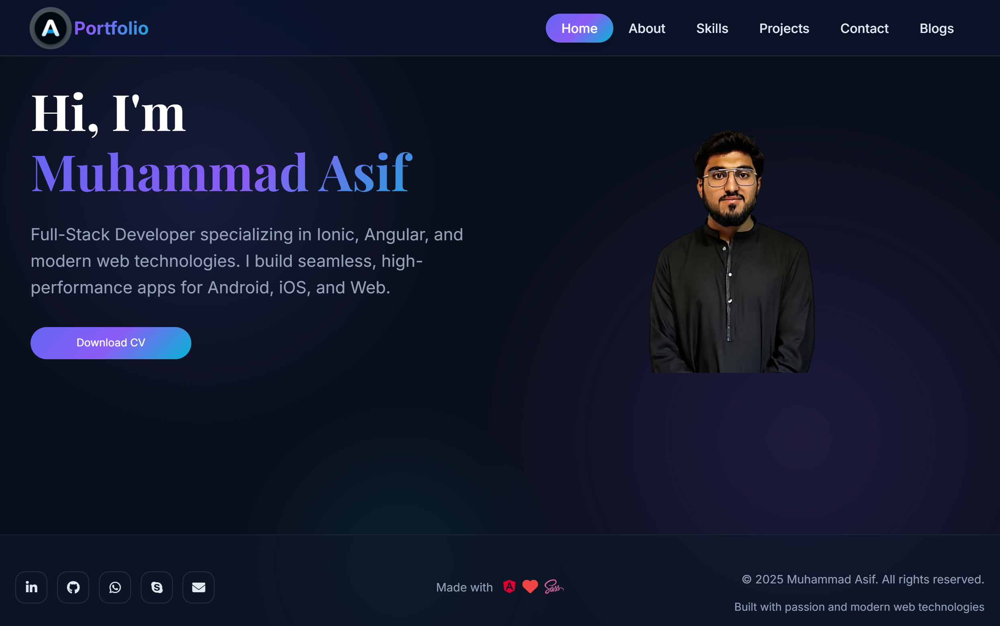
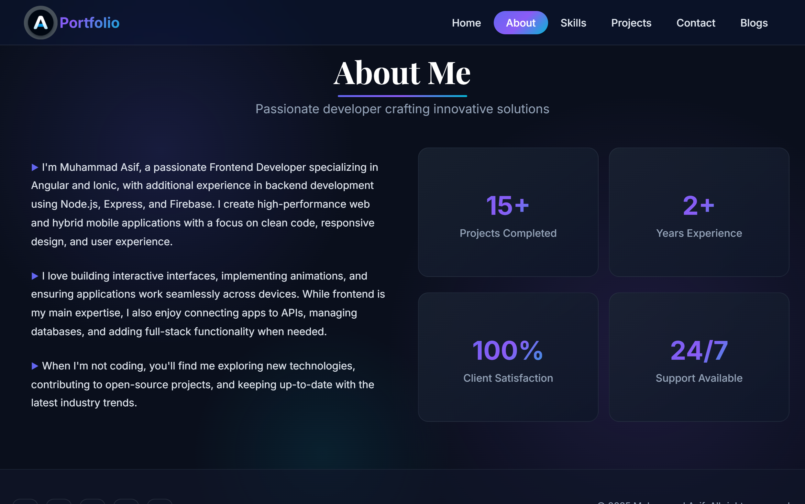
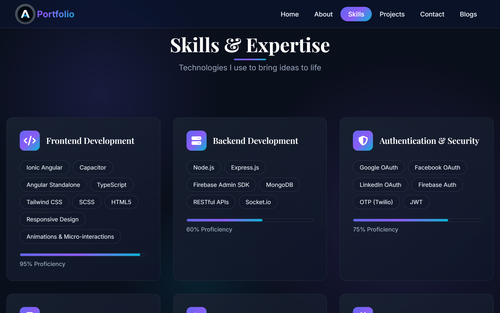
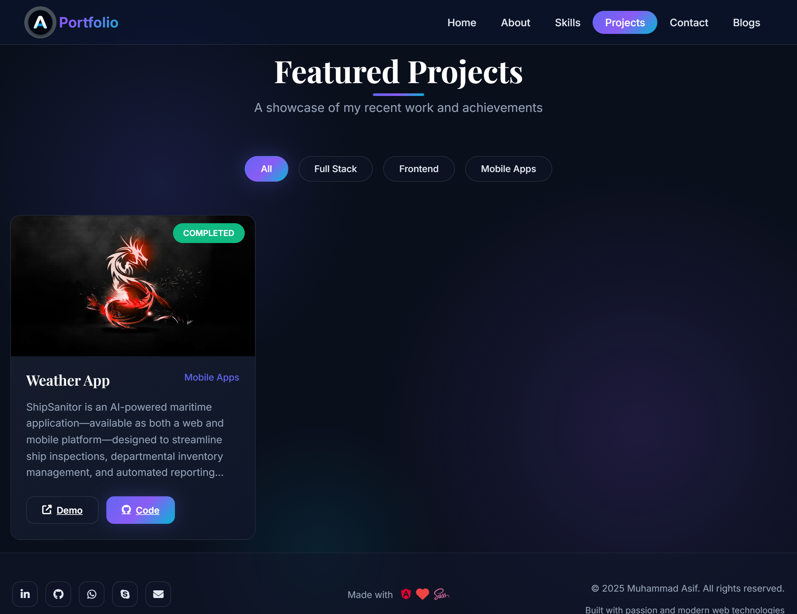
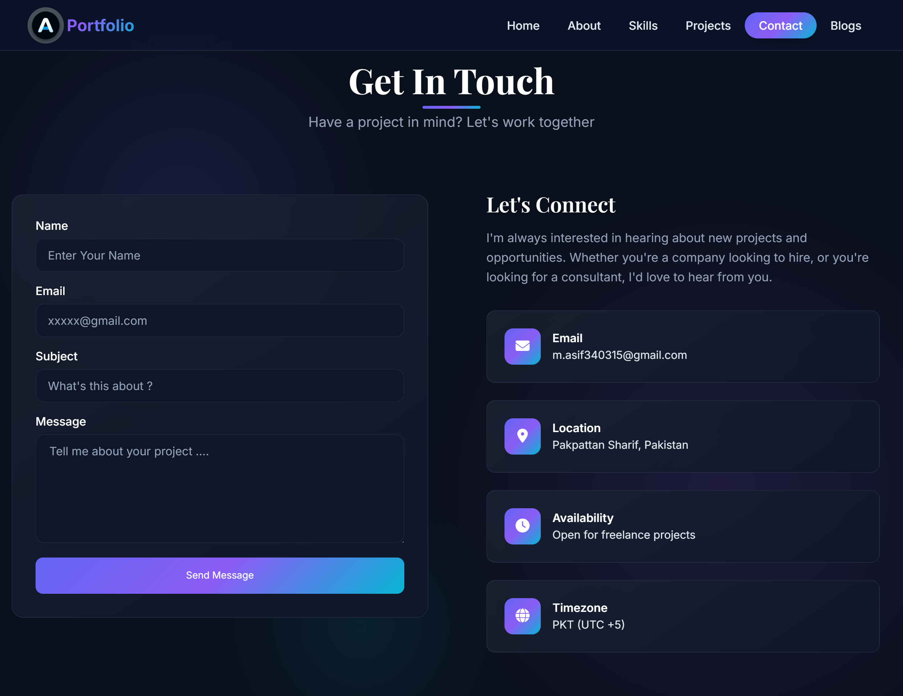

# Portfolio Website

A modern, responsive portfolio website built with **Angular 20** and **Ionic 8**, showcasing professional work, skills, and contact information.

## 🚀 Features

- **Responsive Design**: Optimized for desktop, tablet, and mobile devices
- **Modern UI/UX**: Clean, professional design with smooth animations
- **Cross-Platform**: Built with Ionic for seamless deployment on web, iOS, and Android
- **Performance Optimized**: Lazy loading, standalone components, and efficient routing
- **Interactive Elements**: Typewriter effects, scroll animations, and custom toast notifications
- **Contact Integration**: Built-in contact form with network status monitoring

## 📱 Screenshots

### Home Page

*Welcome page with typewriter effect and professional introduction*

### About Page

*Personal information, statistics, and professional background*

### Skills Page

*Technical skills showcase with proficiency indicators*

### Projects Page

*Portfolio of completed projects with detailed information*

### Contact Page

*Contact form and communication channels*

## 🛠️ Tech Stack

- **Frontend Framework**: Angular 20 (Standalone Components)
- **UI Framework**: Ionic 8
- **Styling**: SCSS with custom themes
- **Icons**: FontAwesome 6.4.2
- **Animations**: Custom scroll animations and transitions
- **Build Tool**: Angular CLI with Vite
- **Mobile**: Capacitor 7.4.3 for native mobile deployment

## 📁 Project Structure

```
src/
├── app/
│   ├── core/
│   │   ├── components/          # Reusable UI components
│   │   │   ├── custom-toast/    # Custom toast notifications
│   │   │   ├── footer/          # Site footer
│   │   │   ├── header/          # Navigation header
│   │   │   ├── layout/          # Main layout component
│   │   │   └── project-cards/   # Project display cards
│   │   ├── interfaces/          # TypeScript interfaces
│   │   └── Services/            # Core services
│   │       ├── api.service.ts   # API communication
│   │       ├── network.service.ts # Network status monitoring
│   │       ├── toast.service.ts # Toast notifications
│   │       └── utility.service.ts # Utility functions
│   ├── Pages/                   # Application pages
│   │   ├── home/               # Landing page
│   │   ├── about/              # About page
│   │   ├── skills/             # Skills showcase
│   │   ├── projects/           # Project portfolio
│   │   ├── project-details/    # Individual project details
│   │   └── contact/            # Contact information
│   └── app.routes.ts           # Application routing
├── assets/
│   ├── screenshots/            # Application screenshots
│   ├── logo/                   # Personal branding
│   └── icon/                   # App icons and favicons
└── theme/
    └── variables.scss          # Ionic theme customization
```

## 🚀 Getting Started

### Prerequisites

- Node.js (v18 or higher)
- npm or yarn
- Angular CLI
- Ionic CLI

### Installation

1. **Clone the repository**
   ```bash
   git clone <repository-url>
   cd portfolio
   ```

2. **Install dependencies**
   ```bash
   npm install
   ```

3. **Start the development server**
   ```bash
   npm start
   # or
   ionic serve
   ```

4. **Open your browser**
   Navigate to `http://localhost:4200`

### Building for Production

```bash
# Build for web
npm run build

# Build for mobile (iOS/Android)
ionic capacitor build ios
ionic capacitor build android
```

## 📱 Mobile Deployment

This project is configured with Capacitor for mobile deployment:

```bash
# Add platforms
ionic capacitor add ios
ionic capacitor add android

# Sync and build
ionic capacitor sync
ionic capacitor build ios
ionic capacitor build android
```

## 🎨 Customization

### Theme Variables
Edit `src/theme/variables.scss` to customize colors, fonts, and other design tokens.

### Content Updates
- **Personal Info**: Update `src/app/Pages/about/about.page.ts`
- **Projects**: Modify `src/app/Pages/projects/projects.page.ts`
- **Skills**: Edit `src/app/Pages/skills/skills.page.ts`
- **Contact**: Update `src/app/Pages/contact/contact.page.ts`

### Assets
- Replace images in `src/assets/logo/` with your own
- Update favicons in `src/assets/icon/`
- Add new screenshots to `src/assets/screenshots/`

## 🔧 Available Scripts

- `npm start` - Start development server
- `npm run build` - Build for production
- `npm run watch` - Build with file watching
- `npm test` - Run unit tests
- `npm run lint` - Run ESLint

## 📄 License

This project is public and proprietary.

## 👨‍💻 Author

**Muhammad Asif** - Full-Stack Developer specializing in Ionic, Angular, and modern web technologies.

---

*Built with ❤️ using Angular, Ionic, and modern web technologies*
